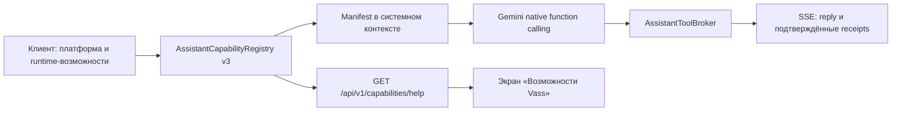

# Аудит возможностей Vass и проект capability help

Статус: release-аудит после поставки `1.2.13 (17)` 2026-07-16. Реализация
поставлена на VPS коммитом `51c4ade`, миграция
`20260716194643_AddStructuredMemoryAttachments` применена. API, admin SPA и
database прошли health-check; Android release APK собран только для
`arm64-v8a` и весит 40.4 MiB. Ниже отдельно отмечены реализованные пути,
закрытые пробелы и сценарии, которые всё ещё требуют проверки на физическом
телефоне.

## Короткий вывод

Vass уже не является только голосовым чатом. В текущей Android-сборке есть
голосовой диалог с VAD, локальная речь, долгосрочная память, локальные
напоминания, фото/файлы/share, плавающий overlay, одноразовый снимок экрана,
YouTube hand-off и админ-панель. Модель использует нативный Gemini function
calling с проверяющим broker-слоем: для этих действий не нужен MCP и нет
разбора произвольного JSON после окончания ответа модели.

Главный пробел исходного аудита закрыт: `AssistantCapabilityRegistry` v3
отдаёт versioned help-каталог, модель имеет read-only `capability_help`, а в
настройках есть экран «Возможности Vass». Каталог даёт понятное название,
естественные примеры и интерфейсную подсказку, но не даёт модели произвольный
deep link, права на системные разрешения или возможность нажимать настройки.

## Методика и обозначения

Аудит сопоставляет мобильный React Native-клиент, Android Expo Module, API,
broker инструментов и админ SPA. Состояние «реализовано» означает, что путь
есть в текущем коде; это не заменяет проверку на физическом устройстве и не
означает, что пользователь уже дал необходимые Android-разрешения.

| Метка | Смысл |
|---|---|
| `доступно` | Пользователь может пройти сценарий в текущем UI. |
| `по разрешению` | Функция есть, но зависит от разрешения, устройства или внешнего обработчика. |
| `код есть, нужен physical smoke` | Сценарий реализован, но его нельзя считать выпускным без матрицы реальных устройств. |
| `не предлагать` | Endpoint или задел существует, но пользовательского безопасного пути нет. |

## Сделано и устранено в release 1.2.13

| Пробел или риск | Что сделано | Статус после поставки |
|---|---|---|
| Закрытая регистрация оставляла пользователя без понятного состояния | API возвращает стабильный `approval_required`, а mobile показывает отдельный экран ожидания подтверждения. | `устранено`; покрыто integration-тестом. |
| Server Piper TTS оставался как аварийная ветка и мог расходиться с mobile TTS | Удалены `PiperTtsService`, chat TTS endpoints, compose-сервис и контейнер `vass-tts-1`; при локальном TTS-сбое текст остаётся в чате. | `устранено`; контейнер удалён на VPS. |
| Legacy API позволял переименовывать и удалять единственный companion-диалог | Удалены `PATCH`/`DELETE /api/v1/chat/sessions/{id}`; история осталась read-only для одного непрерывного диалога. | `устранено`; покрыто integration-тестом. |
| Share и screen capture не возвращали пользователя в понятный контекст | После принятого share/capture Vass возвращается в foreground и локально произносит тип полученного материала или «Снимок экрана получен». | `реализовано`; нужен physical smoke для cold/warm start и accept/cancel. |
| Долгосрочная память не имела стабильной структуры и не хранила полезные вложения | Добавлены 29 стабильных категорий, явное сохранение current attachment, просмотр изображения и открытие PDF/документа системным viewer. | `устранено`; миграция применена на VPS. |
| Напоминания нельзя было увидеть и отменить из продукта или через модель | Добавлены mobile-экран управления, `GET /reminders/manage`, `reminder_list` и `reminder_cancel`, а receipt отменяет локальное уведомление. | `устранено`; API покрыт integration-тестами, mobile-код прошёл TypeScript-проверку. |
| Пользователь и модель не имели единого честного описания возможностей | Добавлены `GET /api/v1/capabilities/help`, экран «Возможности Vass» и read-only tool `capability_help`. | `устранено`; каталог фильтруется runtime-контекстом. |
| Универсальный APK был неоправданно большим | Release собран только с ABI `arm64-v8a`. | `устранено` для текущего тестового канала: 40.4 MiB, подпись и ABI проверены. |

Проверки поставки: `141` unit-тест, `59` integration-тестов, `npx tsc --noEmit`
и production build API прошли без ошибок. Это подтверждает контракты и
сборку, но не заменяет перечисленные ниже Android smoke-сценарии.

## Что доступно пользователю

### 1. Учётная запись и первое знакомство

| Возможность | Статус и вход | Ограничение |
|---|---|---|
| Регистрация и вход по email/password | `доступно` на экране входа. При `REGISTRATION_AUTO_APPROVE=true` доступ выдаётся сразу. | При закрытой регистрации есть отдельный экран ожидания; после подтверждения из admin пользователь входит тем же email и паролем. |
| Вход на новом устройстве по шестизначному коду | `доступно`: код создаётся в настройках уже авторизованного устройства, действует 10 минут. | Одновременно активен один код на пользователя. |
| Первичная настройка | `доступно`: имя пользователя и имя ассистента можно сохранить либо пропустить. | Пропуск сейчас хранится локально; это ещё не полноценный прогресс онбординга по функциям. |
| Выход из аккаунта | `доступно` в настройках. | Локальные напоминания этого аккаунта останавливаются; интервальные серии нужно создать заново. |

### 2. Разговор, голос и история

| Возможность | Статус и вход | Ограничение |
|---|---|---|
| Непрерывный голосовой разговор | `доступно` на главном экране: VAD определяет речь, сервер распознаёт запись, модель отвечает текстом, телефон озвучивает ответ. | Для самого разговора нужен интернет и разрешение на микрофон. |
| Ручная отправка и перебивание | `доступно`: короткий тап по аватару или центральной кнопке отправляет текущую фразу; во время речи этот же тап перебивает ассистента. | Качество voice barge-in зависит от микрофона, уровня внешнего звука и реального устройства. |
| Пауза и продолжение | `доступно`: long press по аватару/центральной кнопке ставит разговор на паузу; короткий тап в паузе продолжает. | Во время паузы запись и воспроизведение остановлены. |
| Текст распознанного запроса и ответа | `доступно` в `ConversationPeek` на главном экране. | Это текущий ход, а не полноценный текстовый редактор чата. |
| История диалога | `доступно` через кнопку истории; есть пагинация по 30 сообщений, отображаются прикреплённые вложения. | Продукт сознательно использует один непрерывный companion-диалог; legacy API создания/переименования/удаления сессий удален. |
| Экран не гаснет во время активного разговора | `доступно` в полноэкранном режиме. | При паузе keep-awake снимается намеренно. |

### 3. Персонализация ассистента

| Возможность | Статус и вход | Ограничение |
|---|---|---|
| Аватар Ольга или Максим | `доступно` в настройках. | Это layered bitmap avatar, а не Rive. Эмоции и рот анимируются имеющимися слоями. |
| Имя ассистента | `доступно` в настройках. | Если имя пустое, используется имя выбранного образа. |
| Системный голос | `доступно`: можно прослушать и выбрать русский голос, вручную пометить его как мужской/женский. | Голоса зависят от установленного Android TTS engine. При ошибке системного TTS ответ остаётся текстом; server-side TTS runtime в продукте отсутствует. |

### 4. Фото, файлы, документы и share

| Возможность | Статус и вход | Ограничение |
|---|---|---|
| Фото основной камерой | `по разрешению`: скрепка на главном экране -> «Сфотографировать». | Камеру открывает только пользователь через Android UI. |
| Селфи | `по разрешению`: скрепка -> «Селфи». | Те же ограничения камеры. |
| Изображение из галереи | `по разрешению`: скрепка -> «Из галереи». | Прикрепляется одно выбранное изображение. |
| Файл, документ или скриншот | `доступно`: скрепка -> «Файл, документ или скриншот». | Выбирается один файл; лимит 50 MiB. Поддержка конкретного формата в модели не гарантирована. |
| Отправка из другого приложения в Vass | `Android, по разрешению источника`: Vass зарегистрирован как share target. Текст/ссылка становится ожидающим текстом, файл копируется во внутренний cache и загружается как вложение. Vass открывается на переднем плане и произносит локальное подтверждение типа материала. | `ACTION_SEND_MULTIPLE` берёт только первый URI. Share text ограничен 20 000 символами, вложение 50 MiB. Перед следующей голосовой репликой пользователь видит preview и может удалить его. |
| Разбор прикреплённого материала | `доступно`: модель получает текущую реплику и вложение одним ходом. | Модель не должна обещать, что распознает любой закрытый/экзотический формат; при нечитабельном содержимом обязана честно сказать об этом. |

Путь вложения намеренно двухшаговый: сначала пользователь выбирает/расшаривает
материал, затем произносит задачу. Так не возникает догадки, к какому именно
сообщению относится файл, и пользователь всегда видит, что будет отправлено.

### 5. Долгосрочная память

| Возможность | Статус и вход | Ограничение |
|---|---|---|
| Сохранить осмысленную запись голосом | `доступно`: модель вызывает `memory_remember` только по явной просьбе и получает подтверждённый receipt. | Нельзя считать запись сохранённой до receipt. Автоматически сохранять «интересные» фразы нельзя. |
| Вспомнить, найти, исправить или забыть запись голосом | `доступно` через native function calls: `memory_status`, `memory_list`, `memory_search`, `memory_correct`, `memory_forget`. | Действия owner-scoped и проверяются broker-слоем. |
| Поиск фрагментов старого разговора | `доступно` модели через `conversation_search`, включая дату/диапазон дат. | Это не свободный доступ к чужим диалогам и не UI-поиск для пользователя. |
| Просмотр и ручное редактирование памяти | `доступно`: Настройки -> «Открыть память». Есть счётчик, обновление, поиск, ручное добавление, редактирование и удаление. | Пользовательский поиск в текущем экране фильтрует загруженный список; серверный semantic search используется моделью. |
| Категория и сохранённое вложение памяти | `доступно`: модель выбирает одну из стабильных категорий, а явная просьба «запомни этот документ/рисунок» сохраняет user-owned attachment вместе с осмысленной записью. | Изображения открываются внутри Vass; PDF/документы передаются системному viewer. Модель не сохраняет вложения без явной просьбы. |
| Очистка всей памяти | `доступно` в UI с отдельным prepare/confirmation token. | Модель не имеет инструмента `memory_clear`; эту операцию нельзя предлагать как голосовое действие. |

### 6. Локальные напоминания

| Возможность | Статус и вход | Ограничение |
|---|---|---|
| Одноразовое напоминание | `по разрешению`: создаётся моделью по явной просьбе и после неё планируется через `expo-notifications` на телефоне. | Нужны корректные device ID, часовой пояс и разрешение на уведомления. После планирования срабатывает без интернета. |
| Периодическое напоминание | `по разрешению`: модель создаёт ограниченный RRULE v2. | Поддержаны daily, weekly с одним днём, monthly 1..28, yearly кроме 29 февраля, hourly 1..168 и minutely 15..10080. Android может сдвигать неточные alarm во время Doze. |
| Синхронизация после запуска | `доступно`: приложение сверяет серверные записи с локальными Android notifications. | Сервер хранит intent/delivery state, но не будит телефон вместо ОС. |

Настройки содержат отдельный список активных напоминаний с обновлением и
отменой. Модель также имеет `reminder_list` и `reminder_cancel`: перед
неоднозначной отменой она сначала получает owner-scoped список, а клиент
отменяет локальный Android notification после SSE receipt.

### 7. Android overlay, возврат в Vass и YouTube

| Возможность | Статус и вход | Ограничение |
|---|---|---|
| Плавающий аватар поверх приложений | `Android, по разрешению`: Настройки -> «Поверх других приложений». | Нужен Android 8+ и special overlay permission. Для sideloaded APK Android может потребовать «Разрешить ограниченные настройки» в карточке приложения. |
| Управление overlay | `доступно` после включения: аватар можно перетаскивать, тап/двойной тап открывает Vass, long press ставит разговор на паузу или продолжает его. Остановить режим можно в настройках или из постоянного уведомления. | При активном overlay Android показывает foreground notification о микрофоне. |
| Экран не гаснет в overlay | `доступно` пока overlay не на паузе. | При паузе удержание экрана снимается. |
| Голосом развернуть Vass | `Android, по разрешению runtime`: `open_vass` передаёт ограниченную команду клиенту. | Это подтверждает передачу команды handler-у, а не произвольное управление системой. |
| Найти ролик в YouTube | `доступно`: модель вызывает `youtube_search`, клиент открывает безопасный URL поиска. | Vass подтверждает только hand-off в YouTube/браузер, а не фактическое воспроизведение. |
| Открыть конкретный ролик YouTube | `доступно`: только известный валидный `videoId` из ссылки/контекста, через `youtube_watch`. | Не допускается придумывать URL или video ID. При запуске внешнего медиа разговор переводится в безопасную паузу до возврата пользователя. |

### 8. Одноразовый снимок экрана

| Возможность | Статус и вход | Ограничение |
|---|---|---|
| «Сделай/посмотри снимок экрана» голосом | `Android, код есть, нужен physical smoke`: модель вызывает `screen_capture_once`, Android показывает стандартное системное подтверждение, Vass возвращается на передний план, снимок загружается как обычное изображение и исходный запрос повторяется с ним. | Только один кадр за запрос, только после явной голосовой просьбы и отдельного системного consent. Непрерывного чтения экрана нет. Если уже приложен файл/изображение, новый capture блокируется. |

### 9. Админ-панель

| Возможность | Статус и вход | Ограничение |
|---|---|---|
| Панель beta-контроля | `доступно` на `/admin/` отдельной React + Vite SPA для роли `Admin`. | Не является мобильной функцией обычного пользователя. |
| Сводка и таблица пользователей | `доступно`: всего/активны 24ч и 7д/сообщения/символы, поиск, фильтр, сортировка, пагинация. | «Сейчас online» в UI означает активность за последние 5 минут, не постоянный WebSocket presence. |
| Подтвердить или ограничить доступ | `доступно`: ограничение сразу инвалидирует JWT; администратор не может заблокировать сам себя. | Реальные token/model usage и стоимость пока не собираются, поэтому панель их не показывает. |

## Инструменты, которыми уже располагает модель

Ниже перечислены не «фразы, которые распознаёт regex», а разрешённые Gemini
function declarations, которые проходят через `AssistantToolBroker`.
Аргументы валидируются независимо от модели, все данные owner-scoped, а
клиентские действия имеют receipt.

| Tool | Назначение | Side effect / граница |
|---|---|---|
| `memory_status`, `memory_list`, `memory_search` | Узнать и найти сохранённые записи. | Только чтение. |
| `conversation_search` | Найти короткие фрагменты старого разговора. | Только owner-scoped чтение. |
| `memory_remember`, `memory_correct`, `memory_forget` | Создать, изменить, удалить одну запись. | Запись выполняется только broker-ом; текст до 1000 символов, для явного attachment — стабильная категория и user-owned файл. |
| `reminder_create`, `periodic_reminder_create` | Создать одно локальное напоминание. | Не более одного попытки напоминания за ход; требуется device context. |
| `reminder_list`, `reminder_cancel` | Показать активные напоминания и отменить конкретное по ID. | Только owner-scoped данные; клиент получает SSE receipt и отменяет свой local notification. |
| `capability_help` | Объяснить доступные возможности, примеры фраз и путь в интерфейсе. | Только чтение каталога; не запускает системный UI и не создаёт side effect. |
| `screen_capture_once` | Запросить один кадр экрана. | Не получает кадр сам; после tool call требуется Android consent и новый ход с прикреплённым JPEG. |
| `open_vass` | Вернуть Vass в foreground. | Только разрешённый navigation handler. |
| `youtube_search`, `youtube_watch` | Открыть YouTube search или валидный ролик. | Только trusted URL template; подтверждается hand-off, не playback. |

Текущий агентный цикл интерактивный и намеренно ограничен: максимум четыре
model step и 25 секунд на один пользовательский ход. Он может выполнить
небольшую цепочку «найти -> уточнить -> записать» в рамках разговора, но не
является долговременным фоновым AgentRun и не должен обещать, что продолжит
работать после завершения ответа.

Обычный текстовый ответ может использовать Google Search grounding у провайдера.
Это не отдельное действие на телефоне и не даёт модели браузерного контроля.

## Что намеренно не следует рекламировать как доступную функцию

- Камера, галерея, document picker, share и Android permissions не являются
  model-callable tools. Модель может подсказать путь, но инициирует их только
  пользователь.
- Модель не читает экран постоянно и не получает снимок без системного
  согласия пользователя.
- Нет общего запуска приложений, произвольных intent/deep link, управления
  телефоном или гарантии, что YouTube начал воспроизводить видео.
- В mobile UI нет BYOK/API-key формы, custom system prompt, управления
  несколькими диалогами или отдельной OCR-кнопки. Server TTS fallback и
  legacy session mutation API намеренно удалены, а не скрыты. Не включать
  оставшиеся server-only возможности в onboarding до появления безопасного UI.
- Сервер уже умеет извлечь явную просьбу о стиле общения вроде «говори
  медленнее» и сохранить её в `CustomSystemPrompt` для будущих ходов. В
  мобильном UI эту инструкцию нельзя увидеть, исправить или очистить,
  поэтому это скрытое поведение, а не честная пользовательская функция.
  Не расширять и не рекламировать его до прозрачного экрана управления.
- Speaker identification по умолчанию выключен. В текущем коде он не имеет
  tenant scope, поэтому его включение без отдельной переработки нарушило бы
  изоляцию пользователей. Никогда не предлагать его модели или пользователю.
- Rive avatar, локальный AI runtime/BYOK и continuous screen assistance не
  являются текущими пользовательскими возможностями.

## Найденные пробелы и release-риски

Актуальный, отдельный release-чеклист перенесён в
[`FEATURE-GAPS-AND-RELEASE-RISKS-2026-07-16.md`](./FEATURE-GAPS-AND-RELEASE-RISKS-2026-07-16.md).
В нём отмечены закрытые пункты и оставшиеся physical-device gates. Главные
нерешённые темы: byte-level compatibility matrix документов, один attachment
за ход, прозрачное управление `CustomSystemPrompt`, metering и 30-минутная
сессия overlay/media.

## Реализованный capability/help контракт

`AssistantCapabilityRegistry` v3 является единым источником истины для
доступности функций в конкретном ходе. `ChatController` передаёт модели
ограниченный manifest, а `AssistantToolBroker` исполняет только объявления
Gemini native function calling.

Реально поставлены три безопасных surface:

- `capability_help(topic)` - read-only инструмент модели. Он возвращает до
  восьми отфильтрованных тем с описанием, примерами фраз и подсказкой по UI.
- `GET /api/v1/capabilities/help` - авторизованный endpoint для mobile UI;
  он принимает известные runtime-флаги и отдаёт тот же отфильтрованный каталог.
- Настройки -> «Возможности Vass» - mobile-экран с обновлением, примерами и
  подсказками. Он ничего не запускает и не просит системных разрешений сам.

`capability_help` не имеет side effect, не принимает произвольный URL, не
создаёт память, не открывает picker и не исполняет deep link. Модель объясняет
доступный путь естественным языком; Android UI, consent и любой tap остаются
только у пользователя.

### Что сознательно не включено в этот релиз

- Нет SSE-события `capability_hint`, кликабельных карточек в диалоге,
  автотура по функциям, progress/onboarding telemetry или настройки
  «Подсказки Vass». Это следующий UX-слой, а не скрытый незавершённый путь.
- Нет model-callable камеры, галереи, document picker, системных разрешений,
  произвольных intent/deep link и управления другими приложениями.
- Каталог фильтруется переданными клиентом runtime-возможностями, но не
  подменяет реальную проверку Android permission и не обещает результат до
  consent пользователя.

### Release-проверка этой темы

- Unit-тест подтверждает, что help-каталог содержит UI hint и скрывает screen
  и YouTube при ограниченном runtime-контексте.
- Integration-тесты покрывают закрытую регистрацию, удаление legacy session
  mutation endpoints, structured memory и list/cancel напоминаний.
- На Android вручную проверить denied/granted camera, share text/image/PDF,
  отказ по 50 MiB, overlay permission/restricted setting, screen capture
  accept/cancel, возврат из YouTube, local reminder без сети и 30-минутный
  разговор. Это оставшиеся release gates, а не недостающий серверный код.

## Основные исходники аудита

- `mobile/src/screens/HomeScreen.tsx`, `mobile/src/hooks/useVoiceChat.ts`,
  `mobile/src/context/ConversationRuntimeContext.tsx`
- `mobile/src/hooks/useVisualInput.ts`,
  `mobile/src/components/VisualSourceSheet.tsx`,
  `mobile/modules/vass-overlay/android/src/main/java/com/vass/overlay/`
- `mobile/src/screens/ProfileScreen.tsx`, `MemoryScreen.tsx`,
  `RemindersScreen.tsx`, `CapabilityHelpScreen.tsx`,
  `RegistrationPendingScreen.tsx`, `ChatHistoryScreen.tsx`,
  `mobile/src/reminders/localReminders.ts`
- `VoiceAssistant.API/Services/AssistantCapabilityRegistry.cs`,
  `AssistantAgentTurnService.cs`, `AssistantToolPlannerService.cs`,
  `AssistantToolBroker.cs`
- `VoiceAssistant.API/Controllers/ChatController.cs`,
  `CapabilitiesController.cs`, `VisualAssetsController.cs`,
  `RemindersController.cs`, `AdminController.cs`
- `docs/ADMIN-PANEL.md`, `docs/react-native/ANDROID-OVERLAY.md`,
  `docs/react-native/reminders.md`,
  `docs/superpowers/specs/2026-07-14-assistant-capabilities-and-memory-tools-design.md`
